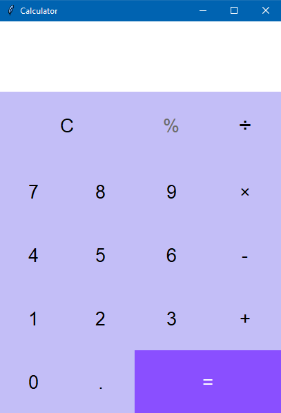

# Calculator
A simple Calculator app made with Python language and Tkinter for GUI

## How to run

- Clone the repo or download the zip file (and unzip it)
- Navigate into the repo/extracted folder
- Install Python (if you have not)
- Open python terminal or command line (or any Python-enabled terminal)
- Run `py app.py`

## Preview

